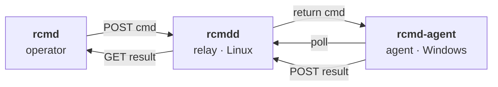

# rcmd

[](https://github.com/obay/rcmd/releases/latest)
[](https://github.com/obay/rcmd/actions/workflows/release.yml)
[](https://go.dev/)

End-to-end encrypted remote command execution over outbound HTTPS — built for networks that block SSH and inspect TLS.



Operator and agent both make only **outbound** HTTPS connections. The relay listens on **:443** (no port 80 needed — Let's Encrypt is handled via TLS-ALPN-01 on the same port).

## Components

| Binary        | Runs on               | Role                                            |
| ------------- | --------------------- | ----------------------------------------------- |
| `rcmd`        | macOS, Linux, Windows | Operator CLI                                    |
| `rcmdd`       | Linux                 | HTTPS relay (autocert via Let's Encrypt)        |
| `rcmd-agent`  | Windows               | Long-polling agent (auto-installs as a service) |

## Installation

| Role     | Command                                                                                                  |
| -------- | -------------------------------------------------------------------------------------------------------- |
| Relay    | `curl -fLO https://github.com/obay/rcmd/releases/latest/download/rcmdd_<ver>_linux_amd64.deb`<br/>`sudo dpkg -i rcmdd_<ver>_linux_amd64.deb` |
| Agent    | `scoop bucket add obay https://github.com/obay/scoop-bucket`<br/>`scoop install obay/rcmd-agent` *(Windows, elevated)* |
| Operator | `brew install obay/tap/rcmd` *(macOS, Linux)*<br/>`scoop install obay/rcmd` *(Windows)*                  |

`.rpm`, `.tar.gz`, and `.zip` artifacts are on the [releases page](https://github.com/obay/rcmd/releases/latest).

## Bootstrap

Set up in order — **relay → agent → operator**.

### 1. Relay

Point a hostname (e.g. `rcmd.example.com`) at the host's public IP, then:

```sh
sudo rcmdd init --domain rcmd.example.com
sudo systemctl enable --now rcmdd
```

`init` generates a master secret, persists `/etc/rcmd/rcmdd.json` (owned by the service user `rcmd:rcmd`, mode `0640`), and prints a **join token** plus the exact `rcmd join` and `rcmd-agent join` commands to copy verbatim. Example:

```
$ sudo rcmdd init --domain rcmd.example.com
Wrote /etc/rcmd/rcmdd.json

Next steps:

  1. Start the relay:

       sudo systemctl enable --now rcmdd

  2. On each Windows agent (elevated PowerShell):

       rcmd-agent join eyJ2IjoxLCJ1IjoiaHR0cHM6Ly9yY21kLmV4YW1wbGUuY29t...

  3. On each operator machine:

       rcmd join eyJ2IjoxLCJ1IjoiaHR0cHM6Ly9yY21kLmV4YW1wbGUuY29t...

The string above is the join token. Anyone who has it can join
the relay; treat it like a secret. Re-print at any time with:
  sudo rcmdd token
```

The first HTTPS request after `systemctl start` triggers Let's Encrypt cert provisioning (a few seconds). Confirm:

```sh
curl -sI https://rcmd.example.com/healthz
# HTTP/2 200
```

#### Insecure mode (no TLS, no DNS)

For trusted-network testing without a domain:

```sh
sudo rcmdd init --insecure --insecure-addr 127.0.0.1:8080 --public-url http://relay-host:8080
```

Command and result payloads are still AES-256-GCM-encrypted end-to-end; only the transport is unauthenticated.

### 2. Agent (Windows)

In an elevated PowerShell, paste the `rcmd-agent join …` line from the relay's output:

```pwsh
rcmd-agent join <token>
```

`join` writes state, then registers and starts the SCM service `rcmd-agent`. The agent ID defaults to the lowercased hostname; override with `--as NAME`. To re-join after a relay rekey, add `--force`.

Useful agent commands:

```pwsh
rcmd-agent status              # state path, relay_url, agent_id
rcmd-agent leave               # stop + uninstall service, remove state
Get-Service rcmd-agent         # check SCM
Get-Content -Tail 20 C:\ProgramData\rcmd\agent.log
```

### 3. Operator

```sh
rcmd join <token> --as alice
rcmd list-agents               # see who's joined
rcmd set-default-agent NAME    # pin one so --agent isn't needed
```

State is at `~/.config/rcmd/rcmd.json` on macOS/Linux or `%APPDATA%\rcmd\rcmd.json` on Windows.

## Commands

### `rcmd status`

Round-trip probe: operator → relay → agent → relay → operator. Exits `0` if both legs are reachable.

```sh
$ rcmd status
relay  https://rcmd.example.com OK (94ms)
agent  win-host-1 OK (150ms)
```

### `rcmd run`

Execute a command on the agent. Stdout and stderr are separate; CLI exits with the agent-side exit code.

```sh
rcmd run [--agent NAME] [--shell cmd|powershell] [--timeout SECS] [--cwd DIR] [--json] -- COMMAND...
```

Examples:

```sh
rcmd run "hostname"
rcmd run --agent win-host-2 "ipconfig /all"
rcmd run --shell powershell "Get-Process | Sort CPU -desc | Select -First 5"
rcmd run --timeout 300 -- msiexec /qn /i C:\install.msi
rcmd run --json "hostname"
```

Exit codes:

| Code      | Meaning                                   |
| --------- | ----------------------------------------- |
| `0`–`255` | Agent-side process exit code              |
| `124`     | Command timed out on the agent            |
| `1`       | Transport or config error (operator side) |

### `rcmd push` / `rcmd pull`

Move a file. End-to-end encrypted; 16 MiB cap (v1).

```sh
rcmd push ./hosts C:\Windows\System32\drivers\etc\hosts
rcmd pull C:\ProgramData\rcmd\agent.log ./agent.log
rcmd push --agent win-host-2 ./script.ps1 C:\Users\Public\script.ps1
```

### `--json`

Every command accepts `--json` for scripting: one JSON object on stdout, agent-side status carried inside the JSON rather than the process exit code.

## Day-2 operations (relay)

| Command           | What                                                                              |
| ----------------- | --------------------------------------------------------------------------------- |
| `rcmdd token`     | Re-print the current join token (no rotation).                                    |
| `rcmdd list`      | Show seen operators + agents with first/last-seen timestamps.                     |
| `rcmdd forget X`  | Remove `X` from the seen list (cosmetic).                                         |
| `rcmdd rekey`     | Rotate the master secret. Invalidates **everyone** — all parties must re-join.    |
| `rcmdd status`    | State health, TLS mode, listen address, ACME cache writable, seen counts.         |
| `rcmdd version`   | Build info.                                                                       |

## Security model

- **One master secret per relay**, 32 random bytes. Generated by `rcmdd init`, embedded in the join token, copied verbatim into agent and operator state. From it, HKDF-SHA256 derives two subkeys: HMAC-SHA256 for request signing and AES-256-GCM for payload encryption.
- **The relay holds the master secret.** That is the explicit security choice: you trust the relay you run. Compromise of the relay = compromise of the system. In exchange, bootstrap is one token, one paste, no key-matrix.
- **Identities are self-declared and observational.** Anyone holding the master secret can claim any identity. The relay records who shows up under what name for `rcmdd list`. Per-party revocation requires `rcmdd rekey` (re-rolls everyone).
- **Transport.** All signed traffic between operator/agent and relay goes over HTTPS on :443. HMAC + replay-prevention (timestamp window + nonce cache) on top. AES-GCM payload layer on top of that. Corporate TLS-inspection proxies are transparent to the AEAD layer.

## Limits (v1)

- One agent is the exercised path; the wire format and queue support N agents.
- 16 MiB per file (`push`/`pull`).
- 8 MiB per command output (4 MiB each for stdout/stderr).
- No interactive shells, no PTY.
- Relay state is small JSON; the command queue is in-memory — restarting the relay drops in-flight commands but keeps the seen list.

## License

MIT.
