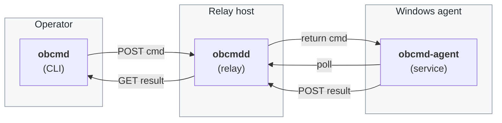

# obcmd

[](https://go.dev/)
[](https://github.com/obay/obcmd/releases/latest)
[](https://github.com/obay/obcmd/actions/workflows/release.yml)
[](https://github.com/obay/obcmd/actions/workflows/ci.yml)
[](https://goreportcard.com/report/github.com/obay/obcmd)
[](LICENSE)
[](https://github.com/obay/obcmd/releases/latest)
[](https://github.com/obay/homebrew-tap)
[](https://github.com/obay/scoop-bucket)
[](#how-it-works)
[](#how-it-works)
[](https://github.com/obay/obcmd/pulls)

Remote command execution over outbound HTTPS. End-to-end encrypted, HMAC-authenticated, and indistinguishable on the wire from ordinary web traffic — suitable for networks where SSH is blocked and TLS is inspected.



> Both sides only ever make **outbound HTTPS to :443**.

## How it works

Three Go binaries:

| Binary         | Where it runs         | What it does                                         |
| -------------- | --------------------- | ---------------------------------------------------- |
| `obcmdd`      | Linux host            | HTTPS relay (Let's Encrypt). Stores only ciphertext. |
| `obcmd-agent` | Windows host          | Long-polls the relay; executes; posts results.       |
| `obcmd`       | Operator workstation  | Operator CLI: `run`, `push`, `pull`, `status`.       |

Transport: HTTPS long-polling on :443. No persistent sockets, no SSH, no third-party tunneling service. Indistinguishable from any web app a browser would talk to.

Security:
- **Authenticity** — every request HMAC-signed with one of two pre-shared keys (`agent_key` or `operator_key`). Replay-protected by timestamp window + nonce cache.
- **Confidentiality** — command payloads and results are AES-256-GCM encrypted with a third key (`payload_key`) that the relay never sees. Survives corporate TLS inspection.
- **No cert pinning** — the agent trusts the system store, so corporate MITM CAs work transparently. The AEAD layer on top makes that safe.

## Install

### Operator (macOS / Linux)

```sh
brew install obay/tap/obcmd
```

On Windows, use Scoop (`scoop install obay/obcmd`).

### Windows (agent)

```pwsh
scoop bucket add obay https://github.com/obay/scoop-bucket
scoop install obay/obcmd-agent
```

The agent is released for Windows amd64 only.

### Relay (Linux)

Via Linuxbrew:

```sh
brew install obay/tap/obcmdd
```

Or grab the deb/rpm from the [latest release](https://github.com/obay/obcmd/releases):

```sh
curl -L https://github.com/obay/obcmd/releases/latest/download/obcmdd_<ver>_linux_amd64.tar.gz | tar -xz
sudo install obcmdd /usr/local/bin/
sudo cp deploy/obcmdd.service /etc/systemd/system/
```

## Configure (one-time)

Generate keys once on any machine — `obcmd keygen --count 3` prints three 32-byte base64 keys. Use them as:

| Key            | Relay (`obcmdd.toml`) | Agent (`agent.toml`) | Operator (`config.toml`) |
| -------------- | :------------------: | :-----------------: | :-----------------: |
| `agent_key`    | ✅                    | ✅                   |                     |
| `operator_key` | ✅                    |                     | ✅                   |
| `payload_key`  |                      | ✅                   | ✅                   |

Each example config in this repo (`config.example.*.toml`) shows exactly what goes where.

### Relay

```sh
sudo useradd -r -s /usr/sbin/nologin obcmd
sudo mkdir -p /etc/obcmd /var/lib/obcmd/autocert
sudo cp config.example.obcmdd.toml /etc/obcmd/obcmdd.toml
sudoedit /etc/obcmd/obcmdd.toml   # paste keys + your domain
sudo chown -R obcmd:obcmd /var/lib/obcmd
sudo systemctl enable --now obcmdd
```

DNS: point your domain at the relay host. Open inbound :80 and :443.

### Windows (agent)

After `scoop install obay/obcmd-agent`:

```pwsh
# Edit %PROGRAMDATA%\obcmd\agent.toml (template is written for you).
# Then, from an elevated PowerShell:
obcmd-agent install
```

### Operator (Mac/Linux)

```sh
mkdir -p ~/.config/obcmd
cp config.example.obcmd.toml ~/.config/obcmd/config.toml
$EDITOR ~/.config/obcmd/config.toml   # paste keys
```

## Use

```sh
obcmd status                                # liveness probe
obcmd run "ipconfig /all"                   # cmd.exe
obcmd run --shell powershell "Get-Process"  # powershell.exe
obcmd run --timeout 300 -- ipconfig /all    # custom timeout
obcmd push ./hosts C:\Windows\System32\drivers\etc\hosts
obcmd pull C:\Windows\System32\drivers\etc\hosts ./hosts.remote
```

Exit code mirrors the agent-side command. Stdout goes to stdout, stderr to stderr, so you can pipe normally:

```sh
obcmd run "dir /b C:\Users\Public" | sort
```

## Limits (v1)

- One agent per relay (multi-agent is on the schema, but tested with one).
- Files: 16 MiB hard cap per push/pull.
- Command output: 8 MiB cap (stdout+stderr each get half); the `truncated` flag is set when hit.
- No interactive shells (no PTY).
- In-memory queue at the relay — restarting the relay drops any in-flight commands.

## Releasing

Tag a release and GitHub Actions does the rest:

```sh
git tag v0.1.0
git push --tags
```

The `.github/workflows/release.yml` workflow runs GoReleaser:
- Builds `obcmdd` (linux, amd64 + arm64), `obcmd` (macOS + linux + windows, amd64 + arm64), and `obcmd-agent` (windows/amd64 only).
- Publishes a GitHub Release with archives, deb, rpm, and checksums.
- Updates the Homebrew tap at `obay/homebrew-tap` (obcmd CLI).
- Updates the Scoop bucket at `obay/scoop-bucket` (obcmd-agent + obcmd CLI).

Required secret: `TAP_GITHUB_TOKEN` — a PAT with `repo` scope on `obay/homebrew-tap` and `obay/scoop-bucket`. Add it under repo settings → Secrets → Actions.

## Layout

```
obcmd/
├── cmd/
│   ├── obcmd/         CLI (run / push / pull / status / keygen / version)
│   ├── obcmdd/        relay (serve / keygen / version)
│   └── obcmd-agent/   agent (run / install / uninstall / service / start / stop)
├── internal/
│   ├── api/            wire types + header names
│   ├── auth/           HMAC sign/verify, nonce cache
│   ├── crypto/         AES-256-GCM seal/open
│   └── queue/          in-memory command queue + result store
├── deploy/             systemd unit, PowerShell installer
├── .github/workflows/  ci.yml, release.yml
└── .goreleaser.yaml
```

## License

MIT.
