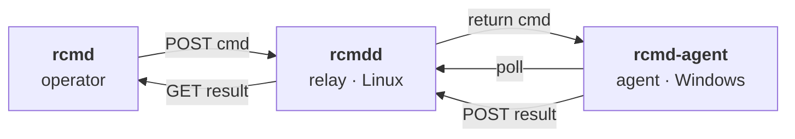

# rcmd

[](https://github.com/obay/rcmd/releases/latest)
[](https://github.com/obay/rcmd/actions/workflows/release.yml)
[](https://go.dev/)

End-to-end encrypted remote command execution over outbound HTTPS — built for networks that block SSH and inspect TLS.



Both sides only ever open **outbound** HTTPS connections. The relay needs inbound **:443**; Let's Encrypt uses TLS-ALPN-01 on the same port, so port 80 is not required.

---

## Installation

Set up the three components in this order: **relay → agent → operator**. The relay must exist before the agent or operator can connect.

| Component       | Command                                                              |
| --------------- | -------------------------------------------------------------------- |
| Relay (Linux)   | `brew install obay/tap/rcmdd`                                       |
| Agent (Windows) | `scoop bucket add obay https://github.com/obay/scoop-bucket`<br/>`scoop install obay/rcmd-agent` |
| Operator        | `brew install obay/tap/rcmd`   *(macOS, Linux)*<br/>`scoop install obay/rcmd`   *(Windows)* |

Direct `.deb` / `.rpm` / `.tar.gz` / `.zip` artifacts are also on the [latest release](https://github.com/obay/rcmd/releases/latest) page.

---

## Usage

### Relay (`rcmdd`)

#### 1. Generate keys

Run once on the relay host. The three keys you generate here are used by all three components:

```sh
$ rcmdd keygen --count 3
TgRBa44lpHynVM8iyymXu1raDoxB6MaTajXjSF0e3pU=
VbAj3FqTu59zaoymrkivyYO0fr3EUc8edFBb8C+Xl38=
NDuLm5hXzJwvq3HXGcIcUyNWLNEJuxwbeYDoMygVm30=
```

Treat the first line as `agent_key`, the second as `operator_key`, the third as `payload_key`. Each key ends up in exactly two of the three configs:

| Key            | Relay | Agent | Operator |
| -------------- | :---: | :---: | :------: |
| `agent_key`    |  ✅   |  ✅   |          |
| `operator_key` |  ✅   |       |    ✅    |
| `payload_key`  |       |  ✅   |    ✅    |

The relay never holds `payload_key`, which is why it can never see plaintext.

#### 2. Write `/etc/rcmd/rcmdd.toml`

```toml
domain         = "relay.example.com"
listen_addr    = ":443"
acme_cache_dir = "/var/lib/rcmd/autocert"
agent_key      = "TgRBa44lpHynVM8iyymXu1raDoxB6MaTajXjSF0e3pU="
operator_key   = "VbAj3FqTu59zaoymrkivyYO0fr3EUc8edFBb8C+Xl38="
agent_ids      = ["win-host"]
```

Replace `relay.example.com` with a hostname whose A/AAAA record points at this host. Let's Encrypt does not issue certificates for raw IP addresses — for IP-only setups see [Insecure mode](#insecure-mode-no-tls).

#### 3. Start the service

```sh
sudo mkdir -p /var/lib/rcmd/autocert
brew services start rcmdd
```

#### 4. Verify

```sh
$ curl -sI https://relay.example.com/healthz
HTTP/2 200
```

The first request may take a few seconds while autocert obtains the Let's Encrypt cert.

#### Insecure mode (no TLS)

If you want to run on an IP or a private network without a domain, set `insecure = true` in `rcmdd.toml`. The relay then listens on plain HTTP at `insecure_addr` (default `:8080`). Command and result payloads are still AES-256-GCM end-to-end encrypted, but the transport itself is unauthenticated — only safe on a trusted network.

---

### Agent (`rcmd-agent`)

#### 1. Write `C:\ProgramData\rcmd\agent.toml`

```toml
relay_url     = "https://relay.example.com"
agent_id      = "win-host"
agent_key     = "TgRBa44lpHynVM8iyymXu1raDoxB6MaTajXjSF0e3pU="   # key #1 from the relay
payload_key   = "NDuLm5hXzJwvq3HXGcIcUyNWLNEJuxwbeYDoMygVm30="   # key #3 from the relay
log_file      = "C:\\ProgramData\\rcmd\\agent.log"
default_shell = "cmd"   # or "powershell"
```

#### 2. Install as a Windows service

```pwsh
PS> rcmd-agent install
service rcmd-agent installed
service started
```

#### 3. Verify

Tail the agent log; you should see polling activity and no auth errors:

```pwsh
Get-Content -Tail 5 -Wait C:\ProgramData\rcmd\agent.log
```

Other service controls: `rcmd-agent start`, `rcmd-agent stop`, `rcmd-agent uninstall`.

---

### Operator (`rcmd`)

#### 1. Write the config

Path:
- `~/.config/rcmd/config.toml` on macOS / Linux
- `%APPDATA%\rcmd\config.toml` on Windows

```toml
relay_url    = "https://relay.example.com"
agent_id     = "win-host"
operator_key = "VbAj3FqTu59zaoymrkivyYO0fr3EUc8edFBb8C+Xl38="    # key #2 from the relay
payload_key  = "NDuLm5hXzJwvq3HXGcIcUyNWLNEJuxwbeYDoMygVm30="    # key #3 from the relay
default_shell        = "cmd"
default_timeout_secs = 60
```

#### 2. Verify the end-to-end path

```sh
$ rcmd status
relay  https://relay.example.com OK (42ms)
agent  win-host OK (188ms)
```

Both lines `OK` means operator → relay → agent → relay → operator works end-to-end. If the relay is OK but the agent is not, the agent isn't polling — check the agent log. If the relay itself is not OK, check DNS and that :443 is reachable.

#### 3. Run commands on the agent

##### `rcmd run`

Executes a command on the agent. Stdout and stderr are returned as separate streams; the CLI exits with the agent-side exit code.

```sh
rcmd run [--shell cmd|powershell] [--timeout SECS] [--cwd DIR] [--json] -- COMMAND...
```

Examples:

```sh
$ rcmd run "hostname"
WIN-HOST

$ rcmd run --shell powershell "Get-Process | Sort CPU -desc | Select -First 3"
...

$ rcmd run --timeout 300 -- msiexec /qn /i C:\install.msi
```

Exit codes:

| Code      | Meaning                                  |
| --------- | ---------------------------------------- |
| `0`–`255` | Agent-side process exit code             |
| `124`     | Command timed out on the agent           |
| `1`       | Transport or config error (operator side) |

##### `rcmd push` / `rcmd pull`

Upload a local file to the agent, or download one from it. End-to-end encrypted; the relay only sees ciphertext.

```sh
$ rcmd push ./hosts C:\Windows\System32\drivers\etc\hosts
$ rcmd pull C:\ProgramData\rcmd\agent.log ./agent.log
```

Hard cap: 16 MiB per file.

##### `--json` (every command)

All commands accept `--json` for scripting. Output becomes a single JSON object on stdout; transport / config errors still set exit code `1`, but agent-side status (`exit_code`, `truncated`, `duration_ms`, …) is carried in the JSON rather than the process exit code.

##### Output limits

Command output is capped at 8 MiB combined (4 MiB each for stdout and stderr). When the cap is hit, the result includes `truncated=true`.

---

## Security

- **Authenticity** — every request is HMAC-signed with `agent_key` or `operator_key`. Timestamp window plus a nonce cache prevent replay.
- **Confidentiality** — command payloads and results are AES-256-GCM encrypted with `payload_key`. The relay never sees plaintext, so corporate TLS inspection between any party and the relay is harmless.
- **Trust model** — the agent trusts the system CA store, so corporate MITM CAs work transparently. The AEAD layer above is what keeps that safe.

## Limits (v1)

- One agent per relay (the wire format is multi-agent; only single-agent is exercised).
- No interactive shells / no PTY.
- In-memory queue at the relay — a restart drops in-flight commands.
